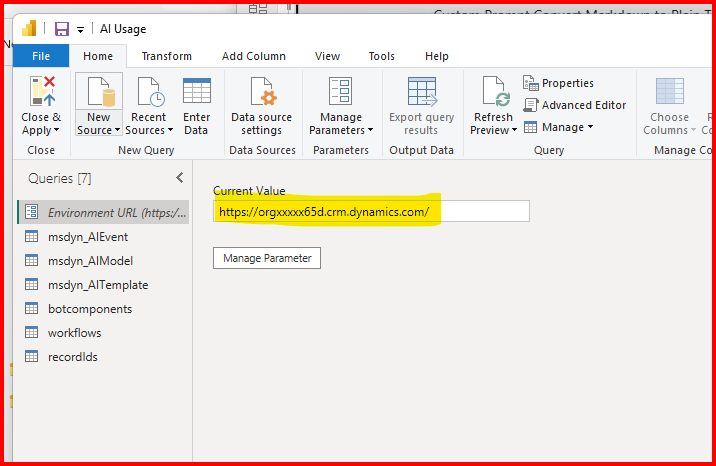
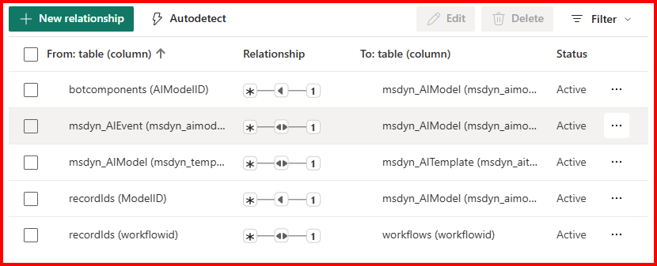
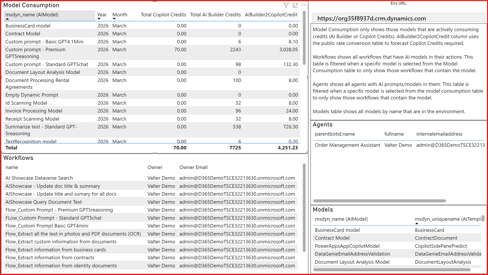

# AI-Builder-Credits-vs-Copilot-Credits
Analysis of AI Builder Credits vs Copilot Credits

This solution contains a Power BI report template that you can connect to ONE Power Platform environment to do analysis of AI Builder Credits and Copilot Credits consumed by resource. Resources could be Agents or Power Automate Flows.

## Requirements
1. Power BI desktop
2. At least the System Customizer security role for the respective environment
3. A Power Platform user license assigned (Power App Premium, Power Automate Premium)

## Install Instructions
1. Download the "AI Usage.pbit" file from the latest Release to a folder on your machine.
2. On your local machine, open up the Power BI desktop application.
3. Log in to Power BI desktop with the same credentials used to access your Power Platform Environment.
4. Open up the .pbit file with Power BI desktop app.
5. From the Home menu, click on "Transform data".
6. Get the Environment URL for the respective Environment. See [Environment Details](https://learn.microsoft.com/en-us/power-platform/admin/environments-overview#environment-details) for more details.
7. Enter in the Environment URL into the "Current Value" textbox. Then click "Close & Apply".

If you get any errors, Power BI desktop app may have updated the relationships upon pbit import.

Do the following:
- close the "Transform data" window. 
- Navigate to the table view and click "Manage relationships".

- Ensure these AND only these relationships exist. 
- Remove, add or edit any relationship as needed. 
- Ensure that the columns used for primary/foreign keys on the relationships match the image.

- Once your edits are complete, navigate back to the Report screen and click "Apply changes" from the yellow bar.

