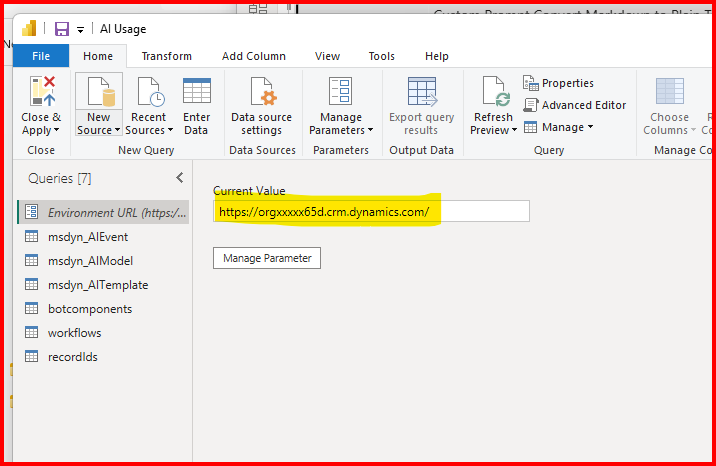
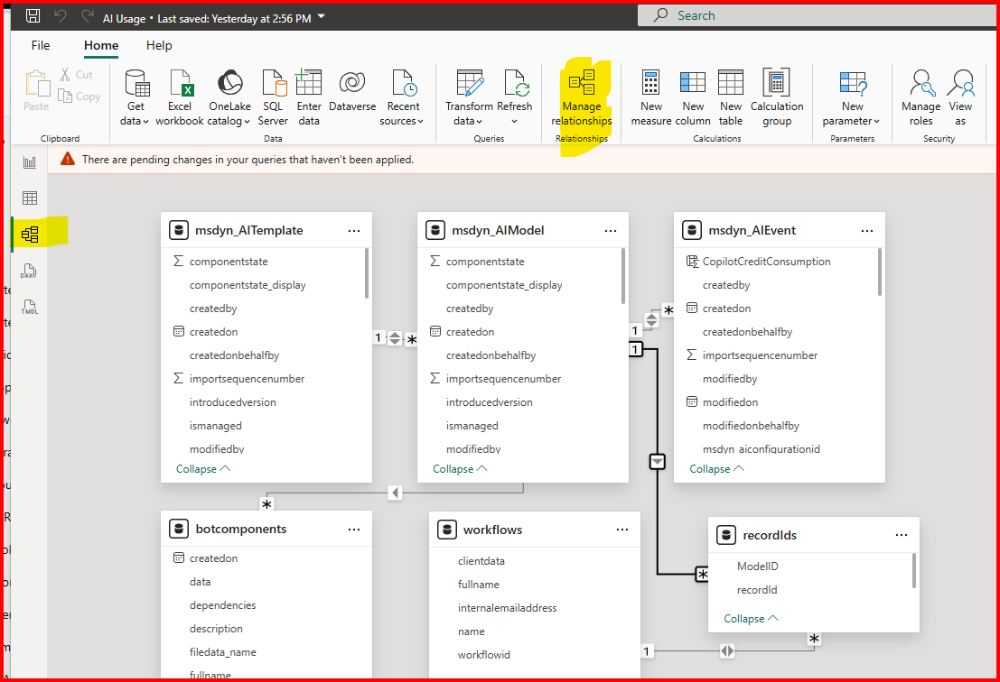
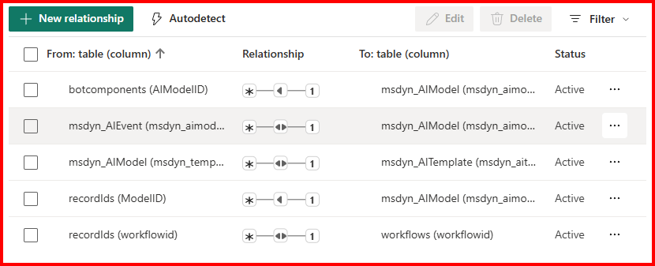
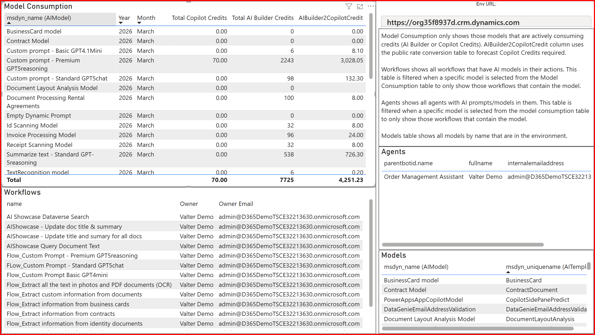
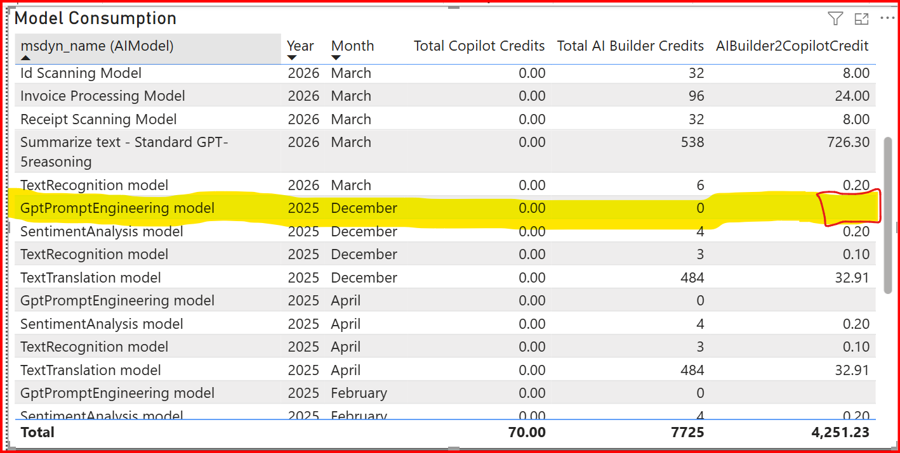

# AI-Builder-Credits-vs-Copilot-Credits
Analysis of AI Builder Credits vs Copilot Credits

- [AI-Builder-Credits-vs-Copilot-Credits](#ai-builder-credits-vs-copilot-credits)
  - [Credits](#credits)
  - [Requirements](#requirements)
  - [Install Instructions](#install-instructions)
  - [How To Use The Report](#how-to-use-the-report)
    - [Explanation of the Model Consumption table](#explanation-of-the-model-consumption-table)
      - [msdyn\_name (AIModel)](#msdyn_name-aimodel)
      - [Year](#year)
      - [Month](#month)
      - [Total Copilot Credits](#total-copilot-credits)
      - [Total AI Builder Credits](#total-ai-builder-credits)
      - [AIBuilder2CopilotCredit](#aibuilder2copilotcredit)

This solution contains a Power BI report template that you can connect to ONE Power Platform environment to do analysis of AI Builder Credits and Copilot Credits consumed by a resource. 

## Credits

Power BI template 

Lori Gowin [lilmrsgowin](https://github.com/lilmrsgowin)

## Requirements
1. Power BI desktop
2. At least the System Customizer security role for the respective environment
3. A Power Platform user license assigned (Power App Premium, Power Automate Premium)

## Install Instructions
1. Download the "AI.Usage.pbit" file from the latest [Release](https://github.com/v7herman4/AI-Builder-Credits-vs-Copilot-Credits/releases) to a folder on your machine.
2. On your local machine, open up the Power BI desktop application.
3. Log in to Power BI desktop with the same credentials used to access your Power Platform Environment.
4. Open up the .pbit file with Power BI desktop app.
5. From the Home menu, click on "Transform data".
6. Get the Environment URL for the respective Environment. See [Environment Details](https://learn.microsoft.com/en-us/power-platform/admin/environments-overview#environment-details) for more details.
7. Enter in the Environment URL into the "Current Value" textbox. Then click "Close & Apply".

If you get any errors, Power BI desktop app may have updated the relationships upon pbit import.

Do the following:
- close the "Transform data" window. 
- Navigate to the table view and click "Manage relationships".

- Ensure these AND only these relationships exist. 
- Remove, add or edit any relationship as needed. 
- Ensure that the columns used for primary/foreign keys on the relationships match the image.

- Once your edits are complete, navigate back to the Report screen and click "Apply changes" from the yellow bar.

The resulting report should look similar to the below image: 

## How To Use The Report
Model Consumption only shows those models that are actively consuming credits (AI Builder or Copilot Credits). AIBuilder2CopilotCredit column uses the public rate conversion table to forecast Copilot Credits required.

Workflows shows all workflows that have AI models in their actions. This table is filtered when a specific model is selected from the Model Consumption table to only show those workflows that contain the model. 

Agents shows all agents with AI prompts/models in them. This table is filtered when a specific model is selected from the model consumption table to only show those workflows that contain the model. 

Models table shows all models by name that are in the environment. 

If convenient you may export the data from any of the tables to a CSV file. Click on the table then click the three dots in the top right and select "Export data".

This information is also available on the report tab "About this report".

### Explanation of the Model Consumption table
#### msdyn_name (AIModel)

This is the name of the Model instance. If its a prebuilt Model the name will be set by AI Hub. If its a trained model or custom prompt the name will be the custom name the author provider. 

#### Year
The year in which this consumption metric is showing.

#### Month
The month in which this consumption metric is showing.

#### Total Copilot Credits
The actual amount of Copilot Credits consumed by this model for the time interval shown. This has no relation to the "Total AI Builder Credits" column. Resources can consume both Copilot Credits and AI Builder credits within a given period.

#### Total AI Builder Credits
The actual amount of AI Builder Credits consumed by this model for the time interval shown. This has no relation to the "Total Copilot Credits" column. Resources can consume both Copilot Credits and AI Builder credits within a given period.

#### AIBuilder2CopilotCredit
The estimate amount of Copilot Credits that would have been consumed given the actual "Total AI Builder Credits" consumed. The models used are compared to this rate table: https://learn.microsoft.com/en-us/ai-builder/administer-licensing#aibuildercapabilityrate-table

Please note that not all rates are available in this conversion table. Any record with a blank value in the "AIBuilder2CopilotCredit" involves a column that has no publicly known conversion.

